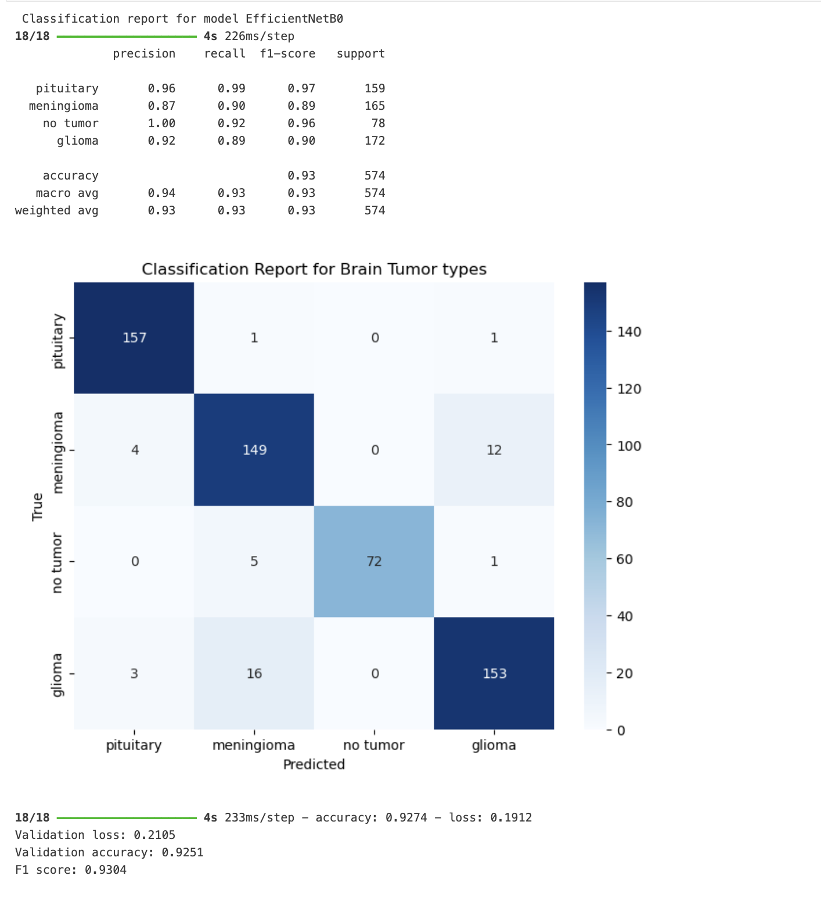
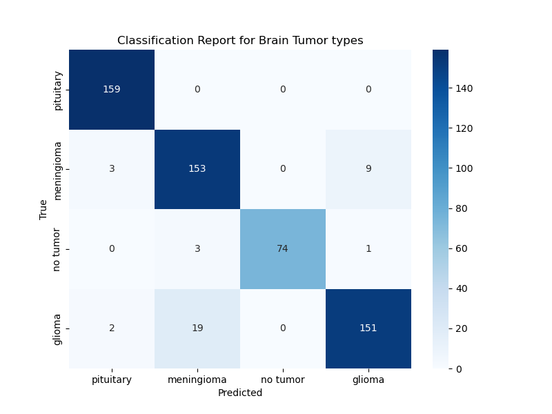
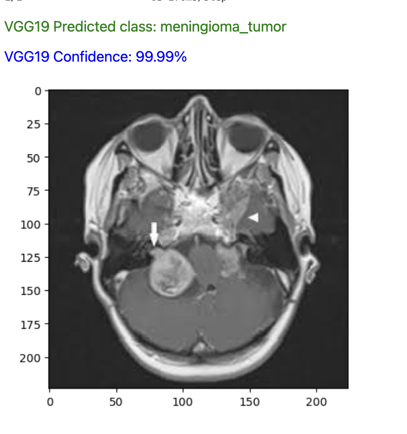
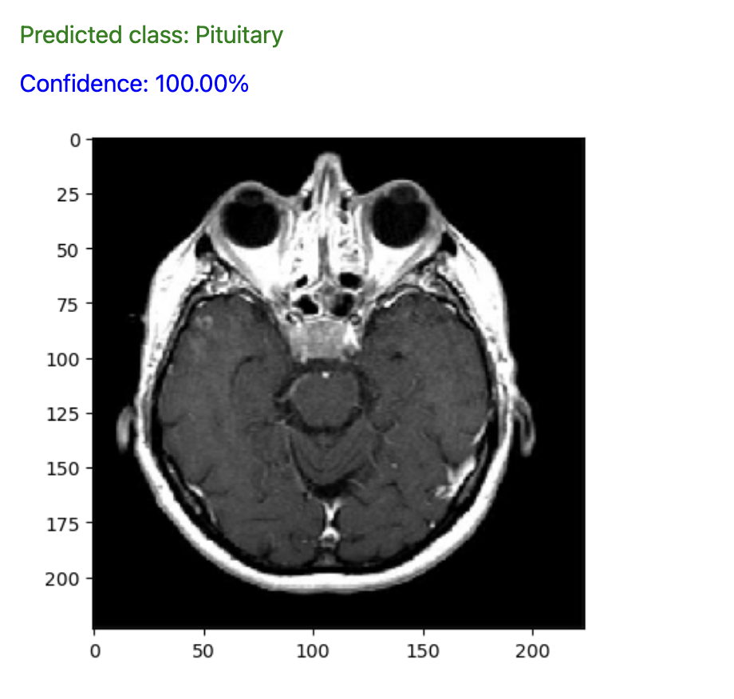
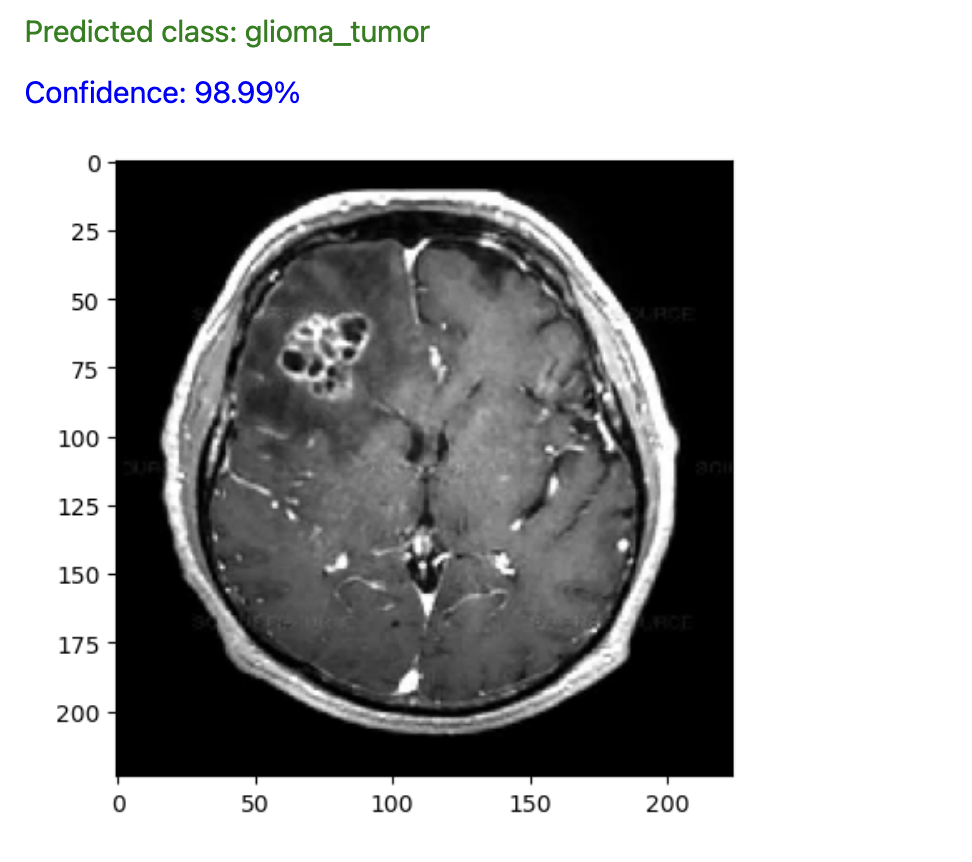
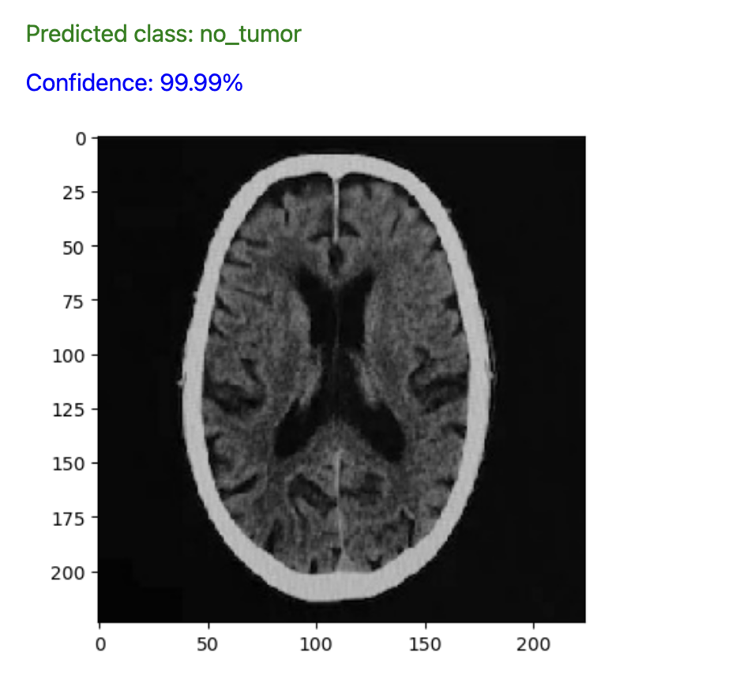

## Using Deep learning CNN models to detect and classify Brain tumors from MRI images

### Executive summary

**Project overview and goals:** 

A brain tumor is the growth of abnormal cells in the brain. The goal of brain tumor detection and classification using Convolutional Neural Networks (CNNs) is to develop an accurate and efficient mechanism for automatically identifying the presence of tumors in medical images such as MRI scans, and categorizing them into specific tumor types - meningioma, pituitary, and glioma tumor. 

Here's a breakdown of the main objectives:
Detection: The primary aim is to accurately locate and identify regions within medical images that contain tumors. This involves segmenting the tumor area from the surrounding healthy tissue.

Classification: Once the tumor regions are identified, the next step is to classify them into different categories based on their characteristics, such as size, shape, and texture. In this case, we can categories specific tumor types like gliomas or meningiomas.

Achieving high accuracy is crucial for reliable diagnosis and treatment planning of brain tumors. The CNN model should be trained on a diverse dataset of annotated medical images to learn the complex patterns and features associated with different types of brain tumors.
The CNN model should generalize well to unseen data, which means it should perform accurately on new medical images that were not part of the training dataset. This requires robust training techniques and regularization methods to prevent overfitting.

Overall, the goal is to develop a CNN-based system that can assist medical professionals in the early and accurate detection and classification of brain tumors, ultimately leading to improved patient outcomes through timely diagnosis and treatment.

**Model Evaluation and Results**

Model performance can be visualized using confusion matrices and classification report which indicate the counts of each error type a model made in the classification task. 

The accuracy of EfficientNetB0 based CNN model is 93% and ResNet101 is 90%
The F1 score of EfficientNetB0 based model is 0.93 and ResNet101 is 0.9085

We can see that both ResNet101 and EfficientNetB0 based CCN model perform well in classifying the brain tumors based on the performance metric comparision.
The choice between the two would depends on the specific requirements which include available computational resources, and desired trade-offs between accuracy and efficiency.

EfficientNetB0 model performed the best and has the ability to accurately detect and classify brain tumors with 93% accuracy.

EfficientNetB0 model performance summary below

ResNet model performance summary below

We can see some qualitative examples of the correct predictions made by the model that gives us insights into the model's behavior and potential areas for improvement.

**Meningioma**

**Pituitary**

**Glioma tumor**

**No Tumor**

### Outline of project

[Link to notebook](./CNN_Brain_Tumor_EDA.ipynb) 

[Link to download data](https://www.kaggle.com/datasets/sartajbhuvaji/brain-tumor-classification-mri) 

